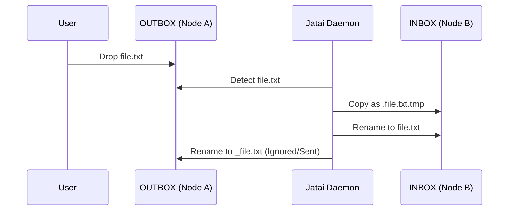
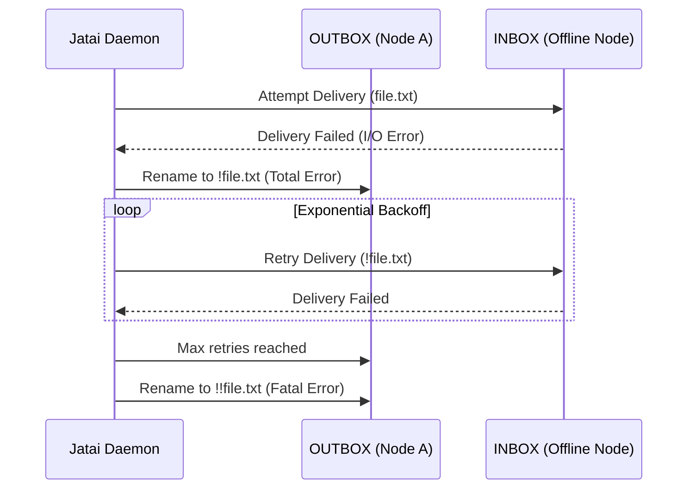

# Prefix State Machine

This document describes the state machine based on Jataí's file prefix philosophy.

## State Transitions

Jataí uses filename prefixes to track the state of messages in INBOX and OUTBOX.



## Retry and Recovery Flows

When a delivery fails, Jataí enters a retry state and uses exponential backoff.



## Orphaned Directories Recovery

When a `.jatai` configuration is removed, the node becomes an orphaned directory and goes into soft-delete. Reactivation requires user intervention.

```mermaid
sequenceDiagram
    participant User
    participant Node
    participant Jatai Daemon
    participant /tmp/jatai/

    User->>Node: Delete .jatai
    Jatai Daemon->>Node: Detect missing .jatai
    Jatai Daemon->>/tmp/jatai/: Add to removed.yaml (--autoremoved)
    Jatai Daemon->>Node: Ignore node operations
    
    User->>Node: Create new .jatai or jatai init
    Jatai Daemon->>Node: Detect new .jatai
    Jatai Daemon->>/tmp/jatai/: Remove from removed.yaml
    Jatai Daemon->>Node: Resume normal operations
```
